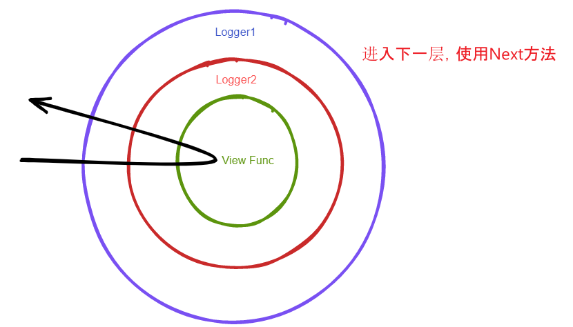

## AOP方案

面向切面编程，主要就是中间件

在实现中间件功能之前，我们先看下Gin框架是怎么使用中间件的。

1. 在`Engine`上使用中间件：表示所有的请求都会执行这个中间件的逻辑

```go

func Logger() HanderFunc {
	return func(ctx *gon.Context) {
		fmt.Println("请求来了！")
		ctx.Next()
		fmt.Println("请求走了！")
	}
}

func main() {
	engine := gin.Default()
	engine.Use(Login()) // 使用中间件
	engine.GET("/", func(ctx *gon.Context) {
		ctx.String(200, "Hello world")
	})
	engine.Run(":8080")
}

```

2. 在`RouterGroup`上使用中间件，表示所有命中这个分组的视图才会执行中间件的逻辑

```go
func Logger() gin.HandlerFunc {
	return func(ctx *gin.Context) {
		fmt.Println("请求来了")
		ctx.Next()
		fmt.Println("请求走了")
	}
}

func main() {
	e := gin.Default()

	e.GET("/", func(ctx *gin.Context) {
		ctx.String(200, "<h1>Hello world</h1>")
	})
	v1 := e.Group("/v1")
	v1.Use(Logger())
	{
		v1.GET("/hello", func(ctx *gin.Context) {
			ctx.JSON(200, gin.H{
				"code": "200",
				"name": ctx.Query("name"),
			})
		})
	}
	e.Run(":8080")
}
```

从上述Gin框架的中间件使用情况来看，可以总结以下要点

1. `Engine`上可以使用中间件
2. `RouterGroup`上可以使用中间件
3. `Context`可以使用`Next`和`Abort`方法控制中间件的执行
3. 中间件的优先级高于普通的视图函数
4. 先注册的中间件函数先执行

结合要点1和要点2，我们可以统一给`RouterGroup`添加上注册中间件的方法`Use`。因为`Engine`组合了`RouterGroup`结构体

```go
type Engine struct {
	router       *router // 路由树
	*RouterGroup         // 路由组
	// 方式一
	middlewares []HandlerFunc
	// 方式二
	groups []*RouterGroup // 集中保存所有的路由组数据
}

type RouterGroup struct {
	prefix      string        // 前缀
	parent      *RouterGroup  // 父路由组
	engine      *Engine       // 保存Engine对象完全是为了拿到Engine中的路由树信息，并对其注册和匹配
	middlewares []HandlerFunc // 存放中间件函数和视图函数。两者有优先级关系。中间件 > 视图函数
}

// Use 中间件注册
func (group *RouterGroup) Use(middlewares ...HandlerFunc) {
    group.middlewares = append(group.middlewares, middlewares...)
}
```
要点3中`Context`需要有`Next`和`Abort`方法。一个用于执行下一个方法，一个用于中断中间件的执行

想想，既然`Context`需要执行中间件方法，那这些中间件方法从哪里来的呢？

是不是需要在请求来的时候
1. 将该路由分组所配置的中间件方法收集好
2. 将命中的视图函数添加到上一步的中间件列表中【一定是放在中间件列表的最后一个】

所以 ——

步骤一：为上下文添加一个中间件列表字段【中间件函数和视图函数是一样的函数签名】
```go
type Context struct {
	// 原始的请求和响应对象
	Writer http.ResponseWriter
	Req    *http.Request

	// 当此请求方式
	Method string
	// 当此请求地址
	URL string
	// 请求参数 不需要暴露出去
	params map[string]string

	// 中间件
	handlers []HandlerFunc // 中间件列表，存放中间件和视图函数
	index    int // 控制中间件函数执行顺序
}
```
步骤二：请求来的时候中间件的收集。要完成这一目标，需要在`ServeHTTP`方法收集。之前我们一直都在说，`ServeHTTP`方法向前对接用户【客户端】，向后对接Web框架
1. 收集中间件
    ```go
    // 对外对接用户，对内对接Web框架
    func (e *Engine) ServeHTTP(w http.ResponseWriter, r *http.Request) {
        // 构建Context上下文
        ctx := NewContext(w, r)
        // 方式一：获取所有的中间件方法，其实不可行，e.middlewares只能拿到Engine上的中间件
        // ctx.handlers = e.middlewares // 将该路由组的中间件函数传给上下文
        // 方式二：因为每个路由组身上都有可能有中间件，所以需要集中保存路由组
        // 但是不是所有的路由组的中间件列表都需要添加到当前上下文中
        // 只有那些符合的情况的才才需要：前缀一样的
        // 注意：这里只是添加中间件，命中的视图函数不是在这里添加
        for _, group := range e.groups {
            if strings.HasPrefix(r.URL.Path, group.prefix) {
                ctx.handlers = append(ctx.handlers, group.middlewares...)
            }
        }
        // 转发请求到框架
        e.router.handle(ctx)
    }
    
    ```
2. 处理命中的视图函数，添加到上下文的中间件列表中
    ```go
    func (r *router) handle(ctx *Context) {
        // 请求来了，需要匹配路由
        log.Printf("Request %4s - %s", ctx.Method, ctx.URL)
        n, params := r.getRouter(ctx.Method, ctx.URL)
        if n == nil {
            // 没有匹配到
            ctx.String(http.StatusInternalServerError, "NOT FOUND")
            return
        }
        // 保存请求参数到Context上下文中
        ctx.params = params
        key := fmt.Sprintf("%s-%s", ctx.Method, n.pattern)
        handlerFunc, ok := r.handlers[key]
        if !ok {
            ctx.String(http.StatusInternalServerError, "NOT FOUND")
            return
        }
        // 构建Context请求上下文
        // 执行命中的视图函数
        // 将命中的视图函数添加到中间件列表中
        ctx.handlers = append(ctx.handlers, handlerFunc)
        ctx.Next()
        //handlerFunc(ctx)
    }
    ```
3. 在第1步的时候，我们是遍历`Engine`的`groups`属性，这个属性是存放所有的路由组，那这个路由路是怎么填充的呢？

步骤三：步骤二的第3步中，我们提出了一个问题，就是`Engine`中的`groups`属性是怎么添加上去的？这就
回到了路由组是怎么创建的？
- 路由组是通过`RouterGroup`结构体的`Group`方法创建的
- 好，那我们就去看这个方法是怎么实现的
    ```go
    func (group *RouterGroup) Group(prefix string) *RouterGroup {
        newGroup := &RouterGroup{
            prefix:      fmt.Sprintf("%s%s", group.prefix, prefix),
            parent:      group,
            engine:      group.engine,
            middlewares: group.middlewares,
        }
        return newGroup
    }
    ```
- 所以，这里我们需要将新创建的路由组添加到`Engine`的`groups`属性中
    ```go
    func (group *RouterGroup) Group(prefix string) *RouterGroup {
        newGroup := &RouterGroup{
            prefix:      fmt.Sprintf("%s%s", group.prefix, prefix),
            parent:      group,
            engine:      group.engine,
            middlewares: group.middlewares,
        }
        // 每生成一个路由组，就需要添加到路由组列表中，方便集中管理
        group.engine.groups = append(group.engine.groups, newGroup)
        return newGroup
    }
    ```
  
再回到要点3，对于中间件和命中的视图函数我们已经收集好了，接下来就是执行中间件列表中的方法了。这个功能的具体实现是在`Next`方法中
```go
// Next 统一执行中间件列表中的函数【中间件，命中的视图函数】
func (c *Context) Next() {
	c.index++
	size := len(c.handlers)
	for ; c.index < size; c.index++ {
		c.handlers[c.index](c)
	}
}
```

完成中断中间件操作方法`Abort`。前面我们说过，`Context`上下文中的中间件列表的执行是通过`index`属性控制的。当我们不想执行中间件的逻辑之后，直接将`index`的值改成一个非常大或者非常小的值都可以
```go
// int类型的最大值
const abortIndex int = math.MaxInt >> 1

func (c *Context) Abort() {
	c.index = abortIndex
}
```

## 测试
```go
package main

import (
	"fmt"
	"github.com/borntodie-new/neo-web/day05/neo"
	"net/http"
)

func Logger1() neo.HandlerFunc {
	return func(ctx *neo.Context) {
		fmt.Println("请求来了Logger1")
		ctx.Next()
		fmt.Println("请求走了Logger1")
	}
}
func Logger2() neo.HandlerFunc {
	return func(ctx *neo.Context) {
		fmt.Println("请求来了Logger2")
		ctx.JSON(200, neo.H{
			"code": "200",
			"msg":  "Logger2退出",
		})
		ctx.Abort()
		//ctx.Next()
		fmt.Println("请求走了Logger2")
	}
}
func Logger3() neo.HandlerFunc {
	return func(ctx *neo.Context) {
		fmt.Println("请求来了Logger3")
		ctx.Next()
		fmt.Println("请求走了Logger3")
	}
}
func Logger4() neo.HandlerFunc {
	return func(ctx *neo.Context) {
		fmt.Println("请求来了Logger4")
		ctx.Next()
		fmt.Println("请求走了Logger4")
	}
}
func Logger5() neo.HandlerFunc {
	return func(ctx *neo.Context) {
		fmt.Println("请求来了Logger5")
		ctx.Next()
		fmt.Println("请求走了Logger5")
	}
}
func main() {
	engine := neo.New()
	engine.Use(Logger1())
	v1 := engine.Group("/v1")
	v1.Use(Logger2())
	{
		v1.GET("/user", func(ctx *neo.Context) {
			fmt.Println("v1/user")
			ctx.String(http.StatusOK, "v1/user")
		})
		v1.POST("/order", func(ctx *neo.Context) {
			fmt.Println("v1/order")
			ctx.String(http.StatusOK, "v1/order")
		})
		v1.DELETE("/cart", func(ctx *neo.Context) {
			fmt.Println("v1/cart")
			ctx.String(http.StatusOK, "v1/cart")
		})
		v1.PUT("/admin", func(ctx *neo.Context) {
			fmt.Println("v1/admin")
			ctx.String(http.StatusOK, "v1/admin")
		})
	}
	v2 := engine.Group("/v2")
	v2.Use(Logger3(), Logger4(), Logger5())
	{
		v2.GET("/user", func(ctx *neo.Context) {
			fmt.Println("/v2/user")
			ctx.String(http.StatusOK, "v2/user")
		})
		v2.POST("/order", func(ctx *neo.Context) {
			fmt.Println("/v2/order")
			ctx.String(http.StatusOK, "v2/order")
		})
		v2.DELETE("/cart", func(ctx *neo.Context) {
			fmt.Println("/v2/cart")
			ctx.String(http.StatusOK, "v2/cart")
		})
		v2.PUT("/admin", func(ctx *neo.Context) {
			fmt.Println("/v2/admin")
			ctx.String(http.StatusOK, "v2/admin")
		})
	}
	_ = engine.Run(":8080")
}

```
## 总结
1. 可能刚开始想不到需要将所有的路由组保存在`Engine`中
2. 如何将所有命中的路由添加上相应的中间件方法【ServeHTTP方法中】
